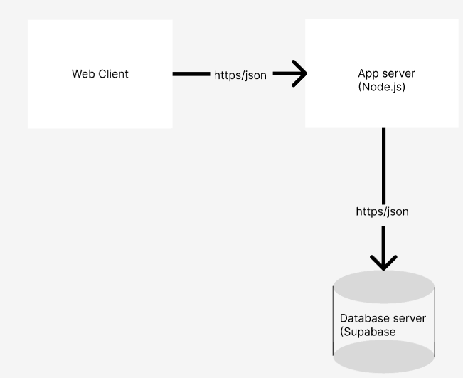
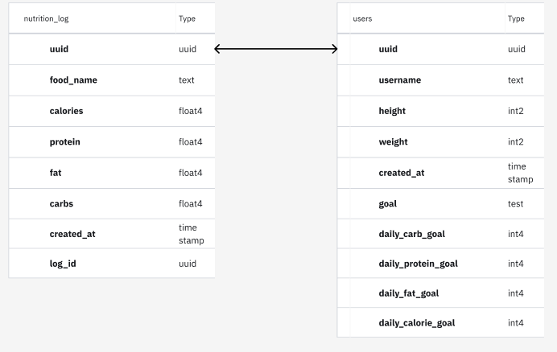
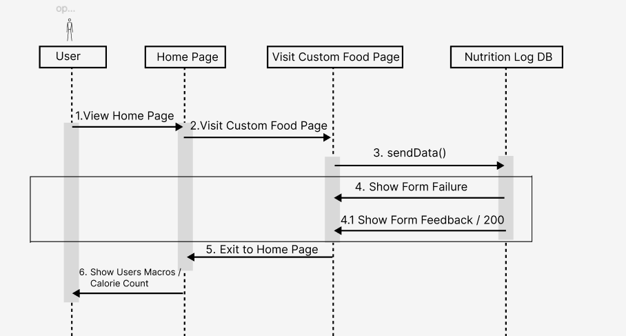

# Spara Architecture

## Component Diagram

Sparta has 3 main components the web client, the app server, and the database server. The web client serves the frontend GUI/ Dashboards to our user. When a user wishes to interact with our frontend such as logging in, updating their macros, logging their customs foods...etc.

The next part would involve the The app server sneding json data to the datavase server (Supabase) with via http request. 

Our database stores our data and returns it back to the app server

## ER Diagram

Our Database holds 2 tables, users and nutrition_log.

User table holds user specfic data such as their goals and height/weight.

nutrition_log stores the uuid of the user that logged it and holds information regarding to a single meal that they ate (macros and calories).

These two tables are related by their uuid. User's table uuid can relate to multiple logged entries by that user.

## Sequence Diagram for adding custom food

The sequence diagram is diagramming a users action to add a custom food.

A user starts by visting the Home page, then clicks on the option to add a custom food. This brings uo the custom food page where a user can add details and then choose to add this entry. 

This now uses our function sendData() to send this data to the backend. If everything is correctly filled then the user recives "feedback" to let them know the entry was successful. If information was missing or their was an issue on the backend the user is shown an error. 

From here a user can choose to exit the custom food page to the home page and then a user would be able to see all updated macros and calorie information. 

