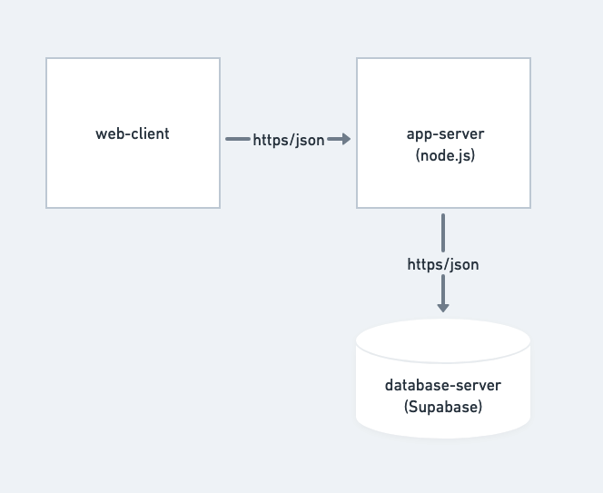
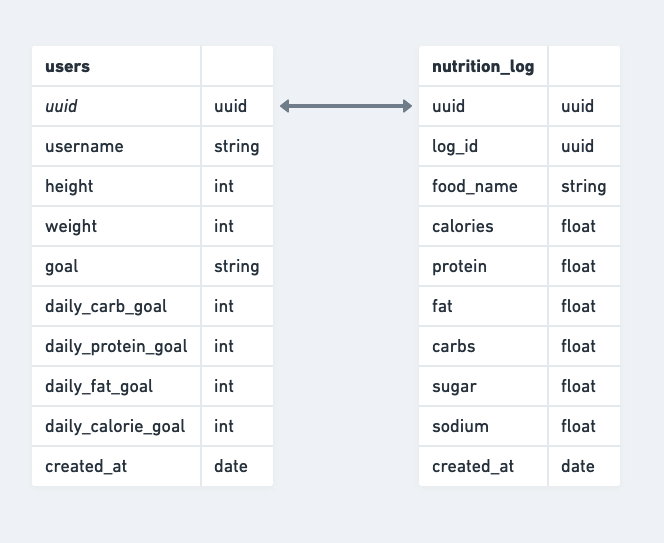
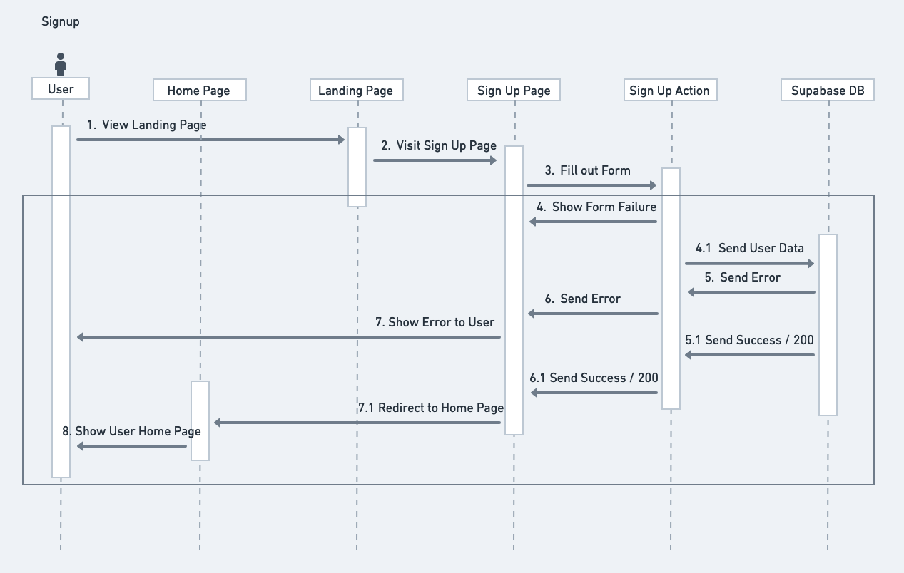

# Sparta Architecture

## Component Diagram

Sparta has three components: the web-client, the app-server, and the database-server. The web-client serves the user with the frontend of our app. When users execute actions such as signing up, signing in, logging a new food, and other actions that require the backend, the web-client sends a https request with relevant json data to the app-server. Next, depending on the action, the app-server sends a https request with relevant json data to the Supabase which is the database-server. Supabase stores the data or returns relevant data base to the app-server. And, a final response is sent to the web-client by the app-server.

## ER Diagram

Our database has two entities: users and nutrition_log. The users table has attributes relating to a user's personal information and goals. The nutrition_log table stores specific food items and their macro/micro nutrient information. The nutrition_log also has a uuid attribute which relates to a uuid in the users table. And, there is a one-to-many relationship between the users table and the nutrition_log. Each user can have many corresponding entries in the nutrition log (entries where uuid matches the user's uuid). But, each item in the nutrition log has only one corresponding user.

## Sequence Diagram for Sign Up

The signup flow starts with the user on the landing page. The user then navigates to the sign up page. Next, the user fills out the form and attempts to create an account. At this point, there are two possibilities. If the user filled out the form incorrectly (missing fields, etc), he is shown the error. If the user filled out the form correctly, the user's data is sent to the database by the signup action. Again, there are two possibilities. If the data is invalid (email already exists, etc), the DB sends an error back to the action. The action sends the error up to the signup page which shows it to the user. On the other hand, if the data is valid, a new user is created in the DB. Then, a success response is sent to the sign up action. The action sends the success up to the sign up page which redirects the user to the home page. The user can now see his information on the home page and begin nagvigating Sparta.
