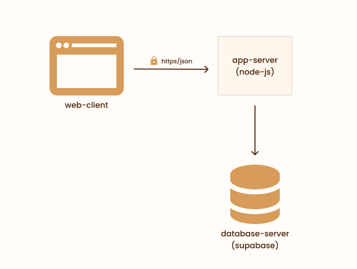
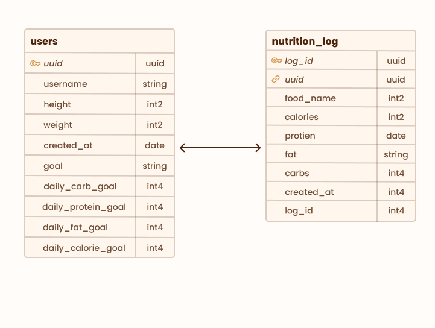
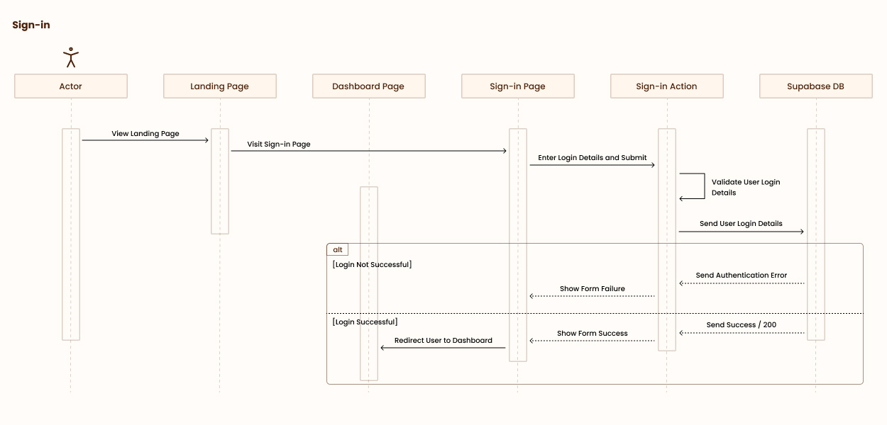

# Sparta Architecture

## Component Diagram

 

Sparta consists of three main components: the web-client, the app-server, and the database-server. The web-client interacts with users, providing the front-end interface of our application. Whenever users perform actions like signing up, signing in, or recording a new food entry—essentially, any action that necessitates back-end processing—the web-client dispatches an HTTPS request carrying pertinent JSON data to the app-server. Depending on the specific user action, the app-server then forwards an HTTPS request with the necessary JSON data to Supabase, our designated database-server. Supabase either stores this data or retrieves the required information to be sent back to the app-server. Subsequently, the app-server relays the final response back to the web-client.

## ER Diagram

 

Our database comprises two primary entities: users and nutrition_log. The users entity contains attributes for a user's personal details and objectives, while the nutrition_log entity captures specific food items along with their macro and micronutrient details. Additionally, the nutrition_log includes a uuid attribute that links to a corresponding uuid in the users entity, establishing a one-to-many relationship. This means a single user can be associated with multiple entries in the nutrition log (where the uuid in the nutrition log matches the user's uuid), but each entry in the nutrition log is tied to only one specific user.

## Sequence Diagram for Sign In

 

The flow for a actor signing in starts on the landing page. The user then navigates to the sign in page. Next, the user fills out the form and attempts to login by filling in their login details and it is sent to Supabase. There are now two alternative scenarios: one where the login is successful and one where it is not. For if it is successful, the user is shown a login successful alert while then being sent to the dashboard page. In the scenario when it is not, the user is given a error alert on the login page and is able to once again fill out their details.