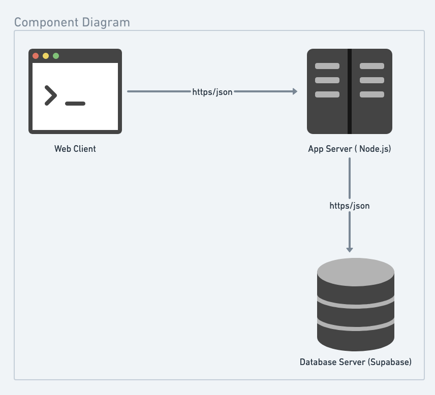
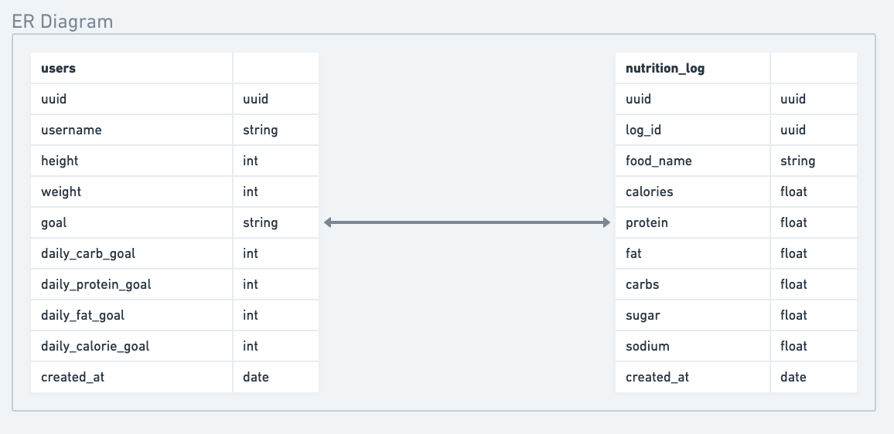
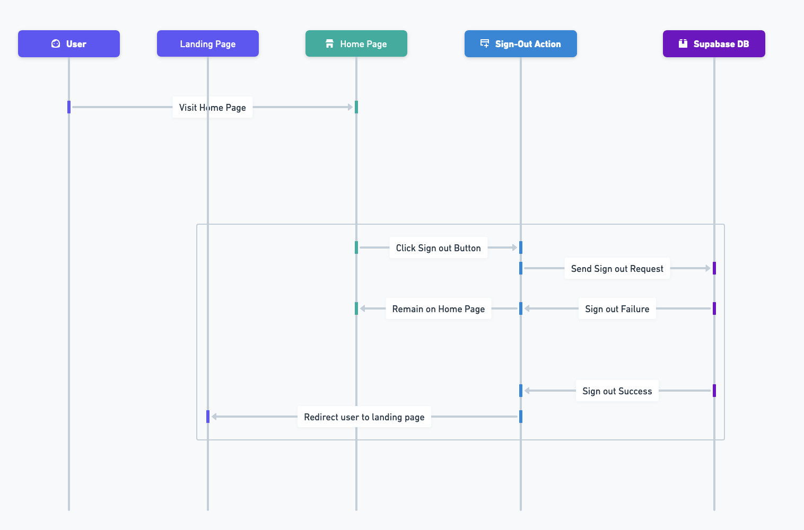

# Sparta Architecture

## Component Diagram

 

Sparta is built upon three primary components: the web-client, the app-server, and the database-server. The web-client serves as the user interface, facilitating user interactions such as account creation, login, and new food entries. Each of these actions initiates an HTTPS request from the web-client, carrying relevant JSON data, to the app-server for processing. Depending on the nature of the user's action, the app-server sends a corresponding HTTPS request, packed with the appropriate JSON data, to Supabase, our chosen database-server. Supabase's role is to either store the incoming data or fetch the needed information, which it then sends back to the app-server. Finally, the app-server delivers the ultimate response to the web-client.

## ER Diagram

 

Our database is structured around two key entities: users and nutrition_log. The users table encompasses attributes that detail a user's personal details and objectives. Conversely, the nutrition_log table is dedicated to recording individual food items along with their macro and micro-nutrient details. A notable feature of the nutrition_log is its uuid attribute, which serves to link each entry back to a specific user in the users table through matching uuids. This setup establishes a one-to-many relationship between the users and the nutrition_log tables, allowing for multiple entries in the nutrition log to be associated with a single user. However, each entry within the nutrition log is uniquely tied to only one user.

## Sequence Diagram for Sign In

 

The flow for a actor signing out starts on the home page. The user then navigates to the sign out button. Upon Clicking the button, the users request is sent to Supbase. There are now two alternative scenarios: one where the sign out is successful and one where it is not. If it is successful, the user is shown a loading screen and redirected to the landing page. In the scenario when it is not, the page shows an error from Supabase.